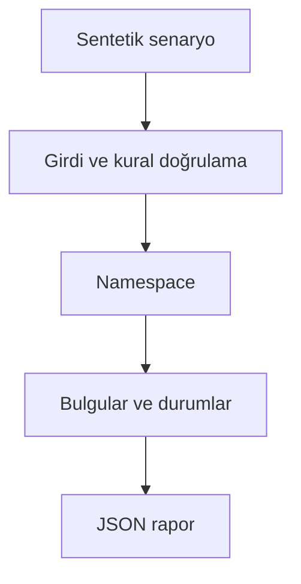

# Mimari

XML okunabilir olsa bile faturanın miktar, para birimi ve toplamlarının çelişmesini saptamak.

Asıl alan akışı: **Boyut/DTD koruması → XML ayrıştırma → satır kuralları → toplam kuralları**. CLI JSON yükler, çekirdek `run(config)` alan motorunu çağırır ve JSON seri hale getirir. Veritabanı kullanan örnekler geçici dizinde izole edilir; kalıcı sınıflar doğrudan çağrılırken dosya yolu dışarıdan verilir.

## İnvariant ve başarısızlık sınırı

Basitleştirilmiş pozitif fatura profili, satır iskonto/masrafı ve tek para birimi kullanılır.

GİB uygunluk sertifikası veya tam XSD/Schematron doğrulaması değildir; tevkifat, döviz ve özel vergi profilleri ayrıca gerekir.

Her hata kararı makine tarafından okunabilir çıktı veya açık exception üretir. Geçersiz yapılandırma sessizce düzeltilmez. Olası tekrarların güvenliği ilgili çekirdeğin kabul kurallarına bağlıdır; bütün projelere ortak bir retry uygulanmaz.
